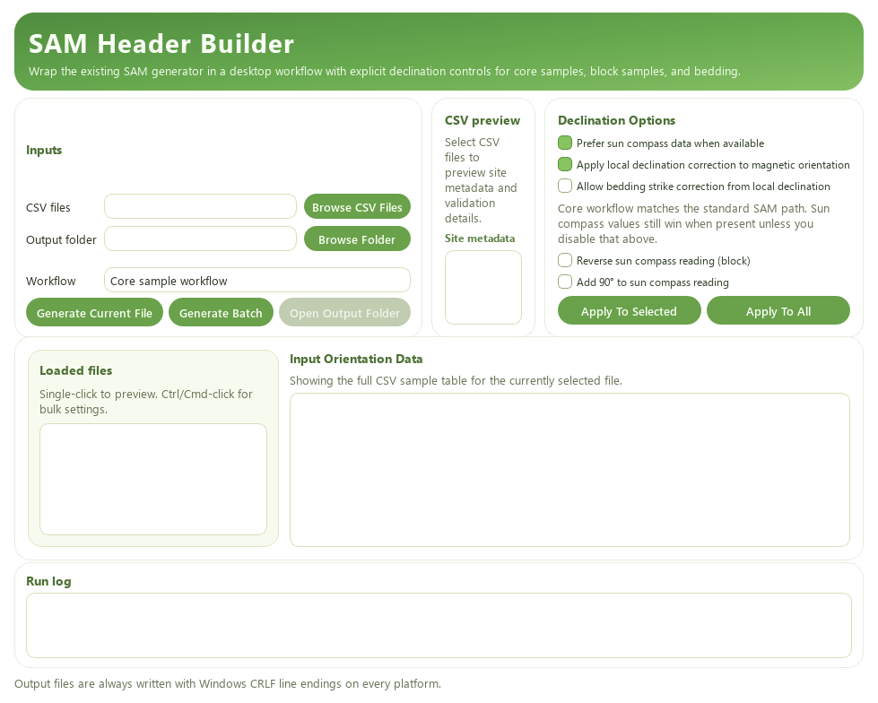
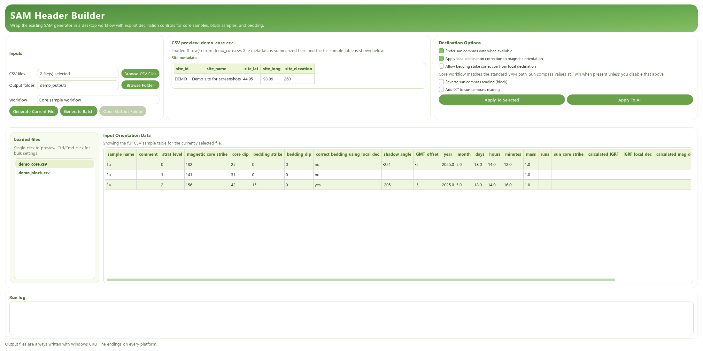
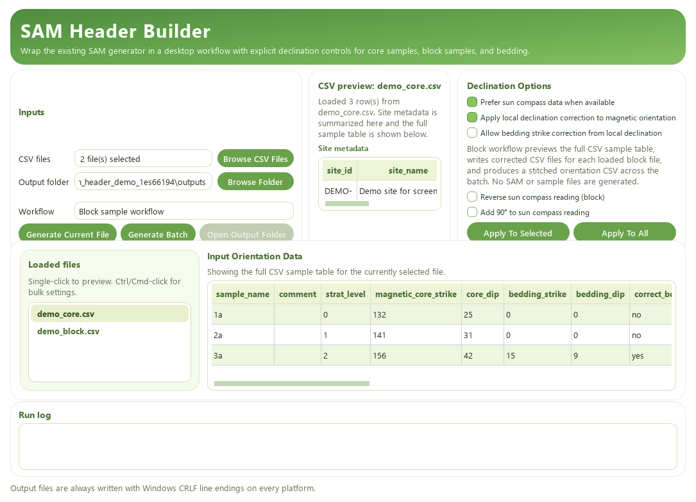

# SAM Header Builder

SAM Header Builder converts site CSV templates into RAPID-compatible outputs for paleomagnetic workflows. The repository now supports two ways of driving the same conversion engine:

- a PySide6 desktop application for interactive review, batch runs, and block-sample workflows
- a command-line interface for scripting and automation

The shared conversion logic lives in [sam_generator.py](sam_generator.py). The GUI in [GUI/app.py](GUI/app.py) and the CLI shim in [mk_sam_file.py](mk_sam_file.py) both call into that same module.

## What This Repository Produces

### Core sample workflow

- A site `.sam` header file
- Individual sample files for each specimen
- An updated CSV with calculated declination fields and chosen orientation values

### Block sample workflow

- A corrected CSV for each loaded block file
- A stitched orientation CSV for the batch
- No `.sam` or sample files

### Line endings

All generated text outputs are written with Windows CRLF line endings on every platform, including macOS.

## Screenshots

### Empty startup state



### Loaded CSVs in core sample workflow



### Loaded CSVs in block sample workflow



## Quick Start

### 1. Create or activate a virtual environment

```bash
python -m venv .venv
```

Windows:

```bash
.venv\Scripts\activate
```

macOS/Linux:

```bash
source .venv/bin/activate
```

### 2. Install dependencies

```bash
python -m pip install --upgrade pip
python -m pip install -r GUI/requirements.txt
```

For reproducible local packaging with the tested versions in this repository, use:

```bash
python -m pip install -r GUI/requirements-build.txt
```

### 3. Launch the desktop app

```bash
python GUI/main.py
```

You can also run the app directly with:

```bash
python GUI/app.py
```

`GUI/main.py` is the safer launcher because it attempts to re-exec into `venv` or `.venv` automatically when available.

## Desktop App Manual

### Inputs card

- `CSV files`: load one or more site templates.
- `Output folder`: choose where generated files will be written.
- `Workflow`: switch between `Core sample workflow` and `Block sample workflow`.
- `Generate Current File`: run only the currently selected preview.
- `Generate Batch`: run all currently loaded valid files.
- `Open Output Folder`: open the most recent output directory after a successful run.

### CSV preview card

- Shows the selected file name.
- Summarizes site metadata from the top rows of the CSV.
- Reports preview or parsing problems before you run generation.

### Declination Options card

- `Prefer sun compass data when available`: when enabled, sun-derived orientation is preferred over magnetic orientation where valid sun data exist.
- `Apply local declination correction to magnetic orientation`: applies magnetic declination correction to magnetic orientation values.
- `Allow bedding strike correction from local declination`: applies declination correction to bedding strike when allowed by the file and workflow.
- `Reverse sun compass reading (block)`: for clockwise block-sampling sun-compass readings.
- `Add 90° to sun compass reading`: alternative block correction path for some field conventions.
- `Apply To Selected` and `Apply To All`: copy the current option state to the selected preview files or every loaded preview.

### Input Orientation Data table

- Shows the full CSV sample table for the currently selected file.
- In both workflows, the preview table remains the full CSV-style table rather than switching to a reduced-format review table.
- Horizontal scrolling is available when the CSV has more columns than the visible panel width.
- Preview values may update live as options change.

### Loaded files sidebar

- Single-click a file to preview it.
- Ctrl/Cmd-click to multi-select files before using `Apply To Selected`.
- Files with usable sun-compass data are highlighted when sun preference is enabled.

### Run log

- Shows per-file progress messages.
- Reports failures with tracebacks.
- Includes warnings such as large differences between calculated magnetic declination and model IGRF declination.

## How To Use The App

### Core sample workflow

1. Click `Browse CSV Files` and select one or more site CSV templates.
2. Choose an output folder. During testing, prefer a separate output folder instead of the source-data folder.
3. Leave the workflow on `Core sample workflow`.
4. Set declination options.
5. Preview each file in the sidebar if needed.
6. Click `Generate Current File` or `Generate Batch`.

Expected outputs:

- `<site_id>.sam`
- one sample file per specimen
- an updated CSV containing calculated fields and selected orientation results

### Block sample workflow

1. Load one or more block-orientation CSV files.
2. Change `Workflow` to `Block sample workflow`.
3. Use the declination and sun-correction controls to preview the effect on the selected file.
4. Apply the chosen settings to selected files or all files.
5. Run `Generate Current File` or `Generate Batch`.

Expected outputs:

- one corrected CSV per loaded block file
- one stitched orientation CSV for the batch
- no `.sam` file and no per-sample files

## Relationship Between GUI And CLI

The GUI and CLI are wrappers over the same conversion functions:

- `convert_csv_to_sam(...)` for core workflow
- `convert_csv_to_block_outputs(...)` for block workflow

The desktop app is best when you need:

- visual preview before generation
- per-file option review in a batch
- quick switching between core and block workflows
- interactive testing of declination settings

The CLI is best when you need:

- reproducible scripted runs
- shell automation
- running one file at a time in a pipeline

## Command-Line Usage

### Legacy entrypoint

```bash
python mk_sam_file.py <input.csv> [output_directory]
```

`mk_sam_file.py` is now only a small shim that forwards to `sam_generator.cli_main()`.

The CLI parser itself lives in [sam_generator.py](sam_generator.py). That module is the shared engine implementation, while [mk_sam_file.py](mk_sam_file.py) is the supported command-line wrapper in this repository.

### CLI options

```text
--orientation-mode {core,block}
--prefer-sun-compass
--ignore-sun-compass
--correct-core-strike
--no-correct-core-strike
--correct-block-strike
--no-correct-block-strike
--correct-bedding-strike
--no-correct-bedding-strike
```

### CLI examples

Core workflow with defaults:

```bash
python mk_sam_file.py path\to\site.csv path\to\output
```

Block workflow with block declination correction enabled:

```bash
python mk_sam_file.py path\to\block.csv path\to\output --orientation-mode block --correct-block-strike
```

Core workflow that ignores sun-compass data:

```bash
python mk_sam_file.py path\to\site.csv path\to\output --ignore-sun-compass
```

## CSV Template Structure

The repository ships both [sam_sample_template.csv](sam_sample_template.csv) and [sam_sample_template.xlsx](sam_sample_template.xlsx).

### Site rows

The first six rows hold site-level metadata:

- `site_id`: required
- `site_name`: optional
- `site_lat`: required decimal latitude
- `site_long`: required decimal longitude
- `site_elevation`: optional elevation in meters

### Required sample fields

- `sample_name`
- `magnetic_core_strike`
- `core_dip`
- `bedding_strike`
- `bedding_dip`
- `mass`

### Optional sample fields

- `correct_bedding_using_local_dec`
- `shadow_angle`
- `GMT_offset`
- `year`
- `month`
- `days`
- `hours`
- `minutes`

## Orientation Rules And Notes

- Sun-compass data are preferred when present and enabled.
- Magnetic orientation values can be corrected by local declination.
- Bedding correction is optional and disabled by default in the current GUI and CLI defaults.
- The updated CSV stores model IGRF output and locally calculated magnetic declination for review.
- If the difference between calculated magnetic declination and model IGRF exceeds 5°, the run log reports a warning.

### Block sampling note

[Instructions_for_block_sample_orientations.md](Instructions_for_block_sample_orientations.md) documents the field convention that block-sampling sun-compass tick marks may run clockwise rather than counter-clockwise. In the GUI, use `Reverse sun compass reading (block)` when that field convention applies.

## Building A Standalone App

PyInstaller build:

```bash
python GUI/build.py
```

The repository includes a checked-in PyInstaller spec at [GUI/SAMHeaderBuilder.spec](GUI/SAMHeaderBuilder.spec). The build script in [GUI/build.py](GUI/build.py) now uses that spec directly so local builds share the same configuration.

Outputs:

- bundled app files in `GUI/dist`
- intermediate build files in `GUI/build`

### Local compilation notes

1. Create and activate a local virtual environment.
2. Install the pinned build environment from `GUI/requirements-build.txt`.
3. Run `python GUI/build.py` from the repository root.
4. Open `GUI/dist/SAMHeaderBuilder/` and launch `SAMHeaderBuilder.exe` on Windows.

The checked-in build configuration currently bundles the GUI icon asset so the compiled app can resolve its runtime resources without depending on the source-tree layout.

### Tested local build environment

- `numpy==2.4.6`
- `pandas==3.0.3`
- `PyInstaller==6.20.0`
- `PySide6==6.11.1`
- `scipy==1.17.1`

## Troubleshooting

### The app launches with missing dependencies

- Run through `python GUI/main.py` so the launcher can re-exec into the local virtual environment.
- Confirm dependencies with `python -m pip install -r GUI/requirements.txt`.

### Preview loads but generation fails

- Read the `Run log` first.
- Check whether the CSV already contains malformed calculated fields from an earlier bad overwrite.
- Prefer using a separate output folder during testing so source CSVs are not overwritten accidentally.

### Sun data are present but the result looks wrong

- Verify `GMT_offset` sign.
- Verify date and time fields.
- For block samples, confirm whether the field sun-compass readings need reversing.

### The table is wider than the window

- Use the horizontal scrollbar in the `Input Orientation Data` panel.
- The preview intentionally keeps the full CSV-style table visible in both workflows.

## Repository Layout

- [sam_generator.py](sam_generator.py): shared conversion engine and CLI parser
- [mk_sam_file.py](mk_sam_file.py): thin legacy CLI shim
- [mk_sam_utilities.py](mk_sam_utilities.py): geomagnetic and sun-angle helpers
- [GUI/app.py](GUI/app.py): desktop application
- [GUI/main.py](GUI/main.py): launcher that prefers the local virtual environment
- [GUI/build.py](GUI/build.py): PyInstaller build entrypoint

